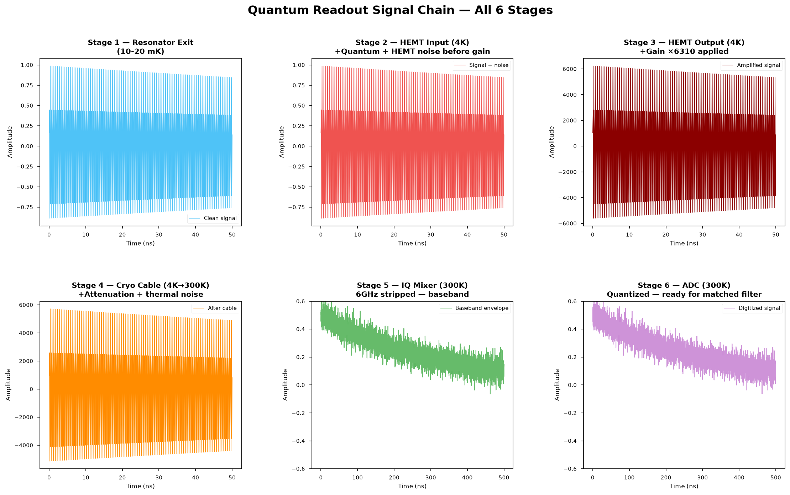

# QuantumReadoutSimulator
A 6-stage hybrid classical simulator modeling the full  microwave signal chain of superconducting qubit dispersive  readout — from resonator exit to ADC digitization. Built in C  with CUDA planned for Part 2.


# Quantum Readout Simulator

A 6-stage physics simulator modeling the complete microwave 
signal chain of superconducting qubit dispersive readout — 
from resonator exit at 10mK to ADC digitization at room temperature.

Built in C. Plots in Python. Physics derived from first principles.



---

## What This Simulates

When a superconducting qubit is measured, a microwave probe 
pulse (~6 GHz) enters the resonator. The qubit shifts the 
resonator frequency by ±χ (dispersive shift), imprinting 
its state onto the probe's phase. The signal then travels 
through 6 physical stages before reaching the simulator:

| Stage | Location | What Happens |
|-------|----------|--------------|
| 1 | 10-20 mK | Resonator releases signal: A·e^(-κt/2)·cos(ωt+φ) |
| 2 | 4K plate | Quantum vacuum noise + HEMT electronic noise added |
| 3 | 4K plate | HEMT amplifier applies ×6310 gain (38 dB) |
| 4 | 4K→300K | Cryo cable attenuation + small thermal noise |
| 5 | 300K bench | IQ mixer strips 6GHz carrier → baseband envelope |
| 6 | 300K bench | ADC quantizes signal → digital samples |

The output of Stage 6 is what a matched filter receives in Part 2.

---

## Physics

The Stage 1 signal is derived from the Jaynes-Cummings 
Hamiltonian in the dispersive regime:         H_JC = ℏω_r(a†a + 1/2) + ℏω_q/2·σ_z + ℏg(a†σ- + aσ+)
After Schrieffer-Wolff transformation:       φ_qubit = ±arctan(2χ/κ) (phase encoding qubit state)
                                             s(t) = V₀·e^(-κt/2)·cos(ω_probe·t + φ_qubit)
Noise is modeled via Friis cascade:          T_sys = T_HEMT + T_room/G_HEMT = 2.8 + 290/6310 = 2.85 K   


Parameters validated against published IBM hardware specs.

---

## Hardware Parameters (Default)
Probe frequency : 6.0 GHz
Resonator linewidth : κ = 2π × 1 MHz → τ = 318 ns
Dispersive shift : χ = 2π × 3 MHz
Amplifier : InP HEMT (T_N = 2.8K, Gain = 38dB)
Cable : CuNi (0.5 dB/m, 1.5m)
IQ Mixer : Low-Noise (6 dB conversion loss)
ADC : 12-bit (4096 levels)

---

## Build and Run

### Requirements
- GCC (MinGW on Windows / gcc on Linux/Mac)
- Python 3 with numpy and matplotlib

### Build
```bash
gcc src/main.c src/resonator_model.c src/signal_model.c \
    src/noise_model.c src/amplifier.c src/materials.c \
    src/print_stage.c -Iinclude -lm -o build/sim
```

### Run
```bash
./build/sim
```

### Plot
```bash
python plot_stages.py
```

### Try Different Hardware
```bash
./build/sim --cable=NbTi --adc=14 --amp=GaAs --qubit=1
./build/sim --kappa=2e6 --chi=4e6
./build/sim --numerical    # RK4 cavity dynamics
```

---

## CLI Reference

| Flag | Default | Options |
|------|---------|---------|
| --qubit | 0 | 0 = \|0⟩, 1 = \|1⟩ |
| --amp | InP | InP, GaAs |
| --cable | CuNi | SS304, CuNi, NbTi |
| --adc | 12 | 8, 12, 14 |
| --kappa | 1e6 | Hz |
| --chi | 3e6 | Hz |
| --numerical | off | RK4 cavity dynamics |

---


## File Structure

QuantumReadoutSimulator/
├── src/
│ ├── main.c ← entry point, CLI parsing, 6-stage pipeline
│ ├── resonator_model.c ← Stage 1: Jaynes-Cummings + RK4 integration
│ ├── signal_model.c ← signal generation and CSV saving
│ ├── noise_model.c ← Stage 2: quantum + HEMT noise (Box-Muller)
│ ├── amplifier.c ← Stage 3: Friis cascade + gain
│ ├── materials.c ← Stages 4,5,6: cable + IQ mixer + ADC
│ └── print_stage.c ← terminal output formatting
├── include/
│ └── common.h ← constants, structs, all declarations
├── data/ ← CSV outputs + plots saved here
├── plot_stages.py ← Python plotting script
└── README.md

---

## Roadmap

- [x] Part 1 — Full 6-stage signal chain
- [ ] Part 2a — Matched filter + readout fidelity
- [ ] Part 2b — Monte Carlo (CPU vs CUDA GPU benchmark)

---

## References

- Blais et al. — Circuit Quantum Electrodynamics (arXiv:2005.12667)
- Krantz et al. — A Quantum Engineer's Guide to Superconducting Qubits (arXiv:1904.06560)
- Wiseman & Milburn — Quantum Measurement and Control

---

## Author

Sridatta — ECE Undergraduate
Building toward EP-enhanced readout and Quantum Fisher Information bounds.( working currently on it )
